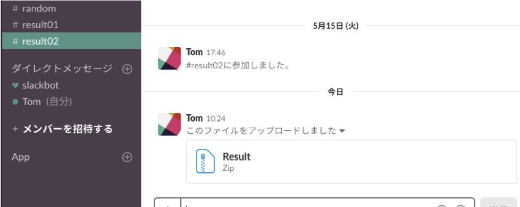

# zOS_Joblog_to_Slack

z/OS上のJOBLOGをSlackに送信するサンプルプログラムです。
  
たとえば、COBOLのコンパイル結果をSlackに送信するような状況を想定しています。この場合、コンパイルのステップの次のステップとして、このプログラムをJCLに追記します。
  
このプログラムは、JavaからJOB名を取得するためにJZOS機能を使い、z/OS1.12以降で提供されるJava SDSFインターフェースも使います。また、Slackとの連携のために、JOBLOGをzipで固めたものをFile.uploadでアップロードするときに使用するレガシー・トークンと、JOBLOGの一部を抜粋したものをメッセージとして表示するためにIncoming webhook URLが必要です。  
*Sample1: Slack Incoming webhook でJOBLOGの一部を出力*  
  
*Sample2: JOBLOGを固めたzipファイルをFile.uploadでアップロード*  
  
*Sample3: サンプルJCL（COBOLコンパイルステップと、このプログラムを起動するステップ）*  
  

---
# 稼働に必要なもの

IBM Java 8.0 on z/OS

# 構成方法
パッケージに含まれるzslack.propertiesを環境に合わせて修正してください。少なくとも、下記のプロパティを確認してください：
- SLACK_TOKEN .. Slack File.uploadのためのレガシー・トークン（zipファイルのアップロード用）
- SLACK_CHANNEL .. zipファイルをアップロードするチャネルの名前（省略可能）
- SLACK_WEBHOOK .. JOBLOGの抜粋をテキスト表示するためのSlack Incoming webhookのURL
- SLACK_WEBHOOK_CHANNEL .. webhook用のチャネルの名前（省略可能）
- SLACK_WEBHOOK_USERNAME .. webhook用のユーザー名
- SLACK_WEBHOOK_REGEX .. ここで指定した正規表現に部分的にマッチしたJOBLOGの行をwebhookでテキスト表示する
  
すべてのファイルを用意したら、以下のコマンドでjarファイルを作成します：  
```jar cvf zslack.jar zslack.properties zslack/*```

# 使用方法
JOBLOGをSlackに送信したいJCLの末尾に、以下のようなJOBLOGのステップを追加します：
```JCL step
//JAVAJVM  EXEC PGM=JVMLDM86,
//         PARM='zslack.SLSendMainC'
//STEPLIB  DD DSN=JZOS.V2R4M1.LOADLIB,DISP=SHR
//SYSPRINT DD SYSOUT=* < System stdout
//SYSOUT   DD SYSOUT=* < System stderr
//STDOUT   DD SYSOUT=* < Java System.out
//STDERR   DD SYSOUT=* < Java System.err
//STDENV   DD *
export JAVA_HOME=/usr/lpp/java/J8.0_64
export CLASSPATH=/installed-path/zslack.jar:$CLASSPATH
export CLASSPATH=/usr/include/java_classes/isfjcall.jar:$CLASSPATH
PATH=$JAVA_HOME/bin:$PATH
export LIBPATH=$JAVA_HOME/bin/j9vm:/usr/lib/java_runtime64:$LIBPATH
export LOGLIST="JESMSGLG JESJCL JESYSMSG"
//
```
  
少なくとも、以下の環境変数を環境に合わせて設定してください：
- CLASSPATH .. 上記で作成したjarファイルを絶対パスで含むように指定
- LOGLIST .. Slackに送信したい、JOBLOG中のアウトプット・データセット名のリスト（空白区切り）

# 参考URL
[JZOS](https://www.ibm.com/support/knowledgecenter/SSYKE2_8.0.0/com.ibm.java.zsecurity.80.doc/zsecurity-component/jzos.html)  
[Slack webhook](https://api.slack.com/incoming-webhooks)  
[Slack file.upload](https://api.slack.com/methods/files.upload)  

# ライセンス
[MIT ライセンス](https://opensource.org/licenses/mit-license.php)に従います。どなたでも無償で無制限にご利用いただけます。

