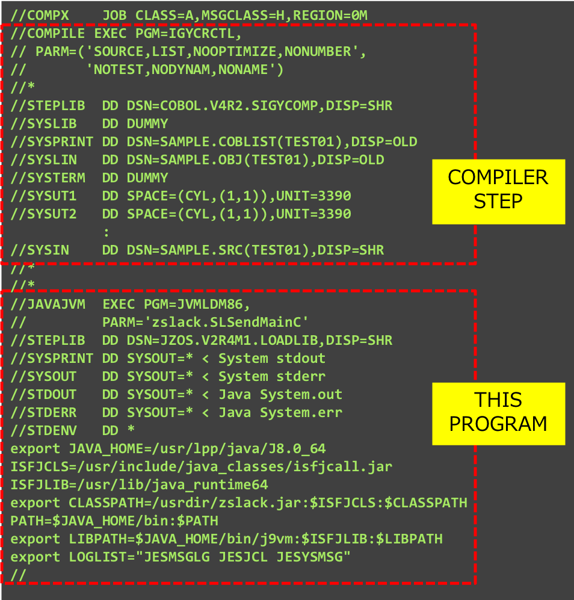

# zOS_Joblog_to_Slack

This is a sample program to send JOBLOGs in z/OS to Slack.
  
For example, it is supposed to send the result of the compiler to Slack channel, by adding this program to the next step of the COBOL compiler step.
  
This program requires the JZOS function of z/OS Java to submit JCL and read temporary datesets.
And Slack Incoming webhook URL and Legacy token for File.upload are necessary.

*Sample1: part of joblog to webhook*  
  
*Sample2: zip file to slack*  
  
*Sample3: sample JCL*  
  

---
# Dependency

IBM Java 8.0 on z/OS

# Setup
At least it is necessary to set values for the following properties in zslack.properties:
- SLACK_TOKEN .. Slack Legacy Token for File.upload
- SLACK_CHANNEL .. Slack channel name to upload zip-file including JOBLOG
- SLACK_WEBHOOK .. Slack Incoming webhook url to upload a part of JOBLOG
- SLACK_WEBHOOK_CHANNEL .. Slack channel name for webhook
- SLACK_WEBHOOK_USERNAME .. username to display for Slack channel
- SLACK_WEBHOOK_REGEX .. regular expression used to extract part of JOBLOG
  
Download all files and create jar file as follows:  
```jar cvf zslack.jar zslack.properties zslack/*```

# Usage
Add the below job-step to a JCL you want to send the joblog to Slack:
```JCL step
//JAVAJVM  EXEC PGM=JVMLDM86,
//         PARM='zslack.SLSubmitter'
//STEPLIB  DD DSN=JZOS.V2R4M1.LOADLIB,DISP=SHR
//SYSPRINT DD SYSOUT=* < System stdout
//SYSOUT   DD SYSOUT=* < System stderr
//STDOUT   DD SYSOUT=* < Java System.out
//STDERR   DD SYSOUT=* < Java System.err
//STDENV   DD *
export JAVA_HOME=/usr/lpp/java/J8.0_64
export CLASSPATH=/installed-path/zslack.jar:$CLASSPATH
PATH=$JAVA_HOME/bin:$PATH
export LIBPATH=$JAVA_HOME/bin/j9vm:$LIBPATH
export JZOSLIB=JZOS.V2R4M1.LOADLIB
export LOGLIST="JESMSGLG JESJCL JESYSMSG"
//
```
  
At least, the following environmental variables are required to set values:
- CLASSPATH .. to add jar file including zslack.properties and this class files
- JZOSLIB .. JZOS-installed Dataset
- LOGLIST .. list of output dataset names in joblog

# Reference
[JZOS](https://www.ibm.com/support/knowledgecenter/SSYKE2_8.0.0/com.ibm.java.zsecurity.80.doc/zsecurity-component/jzos.html)  
[Slack webhook](https://api.slack.com/incoming-webhooks)  
[Slack file.upload](https://api.slack.com/methods/files.upload)  

# License
[MIT License](https://opensource.org/licenses/mit-license.php)

